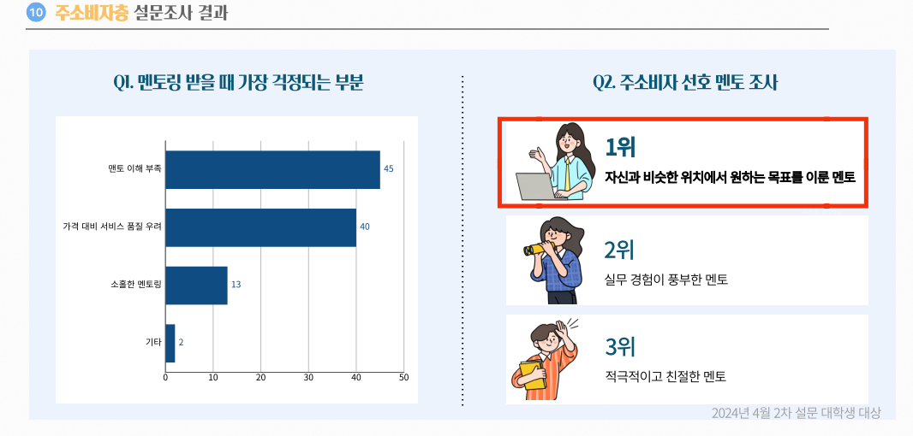
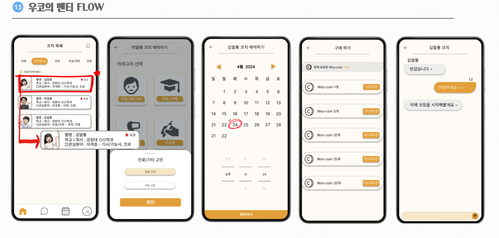
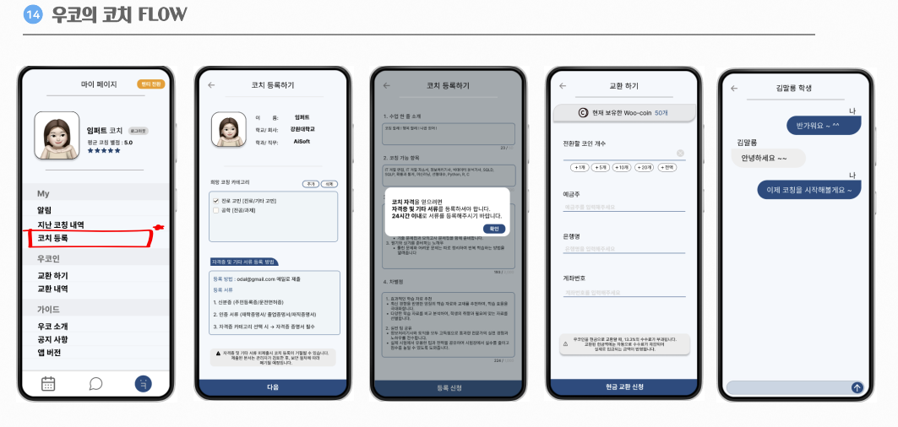

# 2024 캡스톤 프로젝트  
**Wooco (우리가 코치해줄게)**  
> 팀명: **오달말룡**

---

## 🌟 프로젝트 개요  
Wooco는 **국내 최초 중하위권 대학생 대상 비대면 코칭 애플리케이션**입니다.  
취업 준비, 진로 고민 등에서 정보 격차와 기회의 부족을 겪고 있는 중하위권 대학생들을 위해,  
비슷한 환경에서 성공한 멘토들과의 매칭을 통해 현실적이고 공감 가능한 조언을 제공합니다.

---

## 🎯 문제 정의 및 타깃층  

### 문제 정의  
- **MZ세대의 특성:**  
  - 통화나 대면 상담을 어려워하는 세대적 흐름.  
  - 코로나로 인해 비대면 소통의 선호도가 증가.  
- **정보 격차:**  
  - 상위권 대학에 비해 중하위권 대학은 멘토링 활동이 체계적이지 못함.  
  - 대기업 채용 설명회 등 기회 제공의 불균형.  

### 설문조사 결과  
1. 대학생의 **67%**가 취업 및 진로 조언 부족 경험.  
2. **71%**는 직접 대화나 전화로 의사소통에 어려움을 느낌.  
3. 멘토링 시 가장 걱정되는 부분은 **"멘토가 나를 이해하지 못할까봐 두렵다"**는 응답.  

### 타깃층  
- **중하위권 대학생 및 취업준비생:**  
  - 상위 10%를 제외한 대학 출신의 학생들.  
  - 현실적인 조언과 공감 가능한 멘토링을 필요로 함.  
- **멘토 역할 가능 직장인:**  
  - 비슷한 환경에서 성공한 경험을 가진 졸업생들.  

---

## 🚀 주요 기능  

### 1) 카테고리 설정  
- 사용자가 고민 분야(진로, 취업 등)를 선택하여 적합한 멘토를 매칭.  
- 선택한 카테고리와 세부 카테고리는 상단에 표시.  

### 2) 멘토 및 멘티 흐름  
#### 멘티:  
- 카테고리 설정 → 멘토 목록 확인 → 예약 및 상담 진행 → 목표 달성을 위한 피드백 수령.  

#### 멘토:  
- 코칭 등록 → 코칭 진행 및 우코인 수령 → 코인을 교환하여 보상 획득.  

### 3) 우코인 시스템  
- 사용자는 우코인을 구매하여 멘토링 서비스를 이용 가능.  
- 멘토는 코칭 완료 시 우코인을 수령하고, 이를 교환 가능.  

### 4) 나의 일정 관리  
- 멘토와 멘티가 수업 일정을 한눈에 확인 가능.  
- 효과적인 시간 관리 도구 제공.  

### 5) 활용 가능성 확장  
- **대학별 인기 코치 시스템 도입:**  
  - 학교 측에서 인기 코치를 초청하여 강연 요청 가능.  
  - 새로운 유저 유입 가능성과 정보 격차 해소 기대.  

---

## 🛠 개발 과정  

### 주요 일정  
- **3~6월:** 기능 및 인터페이스 설계, 데이터 모델링.  
- **8월:** 본선 진출 후 스피치 및 특허 관련 특강 수강.  
- **9월:** 최종 과제 완료 및 발표.  

### 주요 개선 사항  
- 초기 계획보다 일정이 연장되었으며, 사용자 피드백을 반영하여 기능 최적화 진행.  

---

## 🎯 Wooco의 정체성  

**기회, 비대면, 공감, 합리적 접근성**  
- **기회:** 정보 격차를 해소하여 누구에게나 열려 있는 기회 제공.  
- **비대면:** 부담 없는 비대면 플랫폼.  
- **공감:** 비슷한 환경의 멘토를 통한 현실적 조언 제공.  
- **합리적:** 사용자 친화적 비용 구조와 효율적 서비스 설계.  

---

## 🎯 기대 효과  

1. **멘토링 활성화:**  
   - 중하위권 대학생들의 멘토링 경험 확대.  
2. **정보 격차 해소:**  
   - 상위권 대학과의 기회 불균형 문제 개선.  
3. **수익화 가능성:**  
   - 사용자 경험을 저해하지 않는 범위 내에서 광고 수익 창출 가능.  
4. **브랜드화:**  
   - Wooco 로고 및 서비스명을 상표로 등록하여 플랫폼 성장 가능성 확보.  

---

## 👥 팀 구성  

| 이름   | 역할          |
|--------|--------------|
| 임현정 | 백엔드(팀장)   |
| 박찬휘 | 백엔드        |
| 김유나 | 프론트엔드    |
| 차종호 | 프론트엔드    |

---

## 📢 추가 정보  

프로젝트 관련 자세한 사항 및 코드 베이스는 [깃허브 리포지토리](https://github.com/ParkChanHwi/Wooco/tree/master)에서 확인할 수 있습니다.  
기타 문의 사항은 이슈를 통해 남겨주세요!  
